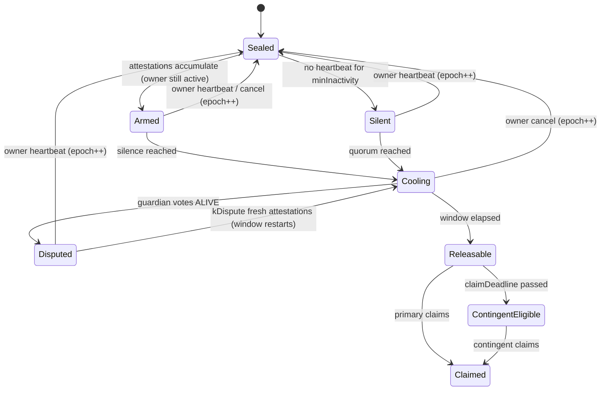

# Heirloom — Trust-Minimized Digital Inheritance

**Bit N Build · Internal Round · Blockchain Track · Problem Statement 2**

---

## 0. The pitch (60 seconds)

Every existing digital-inheritance product makes one of two bets. **Platform products** (Apple Legacy Contact, Google Inactive Account Manager, Bitwarden Emergency Access) ask you to trust the company, and they release your data on a **single signal**: a death certificate submitted to that company, or a timer running out. **Crypto products** (Sarcophagus, Vault12) remove the company, but they still rely on one signal (a missed check-in) or let a group of guardians decrypt on their own.

Heirloom is built on one idea: **a release needs two things that no single person controls.**

1. **Cryptographically**, the decryption key is split between the *guardians* and the *beneficiary*. Neither side can decrypt alone. That includes us.
2. **Procedurally**, a release needs *machine-observed silence* from the owner **and** a *human quorum* of guardians, held for a *cooling window* that the owner can cancel with one passkey tap.

An admin-less smart contract acts as referee and notary. It holds **no secrets**. It only decides *when* guardians are allowed to hand over their pieces, and it records everything. If Heirloom the company disappears tomorrow, heirs can still recover using a static recovery page and the chain.

---

## 1. Design invariants

Every component below exists to enforce one of these five invariants. Each item in the demo proves one of them.

| # | Invariant | Enforced by |
|---|---|---|
| **I1** | No single party can decrypt: not Heirloom, not one guardian, not *t* guardians, not the beneficiary. | Split-knowledge key (§4) |
| **I2** | No single signal can start a release. Release needs owner silence **and** a guardian quorum **and** an elapsed window. | Release rule (§5.2) |
| **I3** | While the owner is alive, the owner always wins. One tap cancels everything not yet released. | Epoch reset (§5.5) |
| **I4** | Correctness never depends on our servers or a bot. State is computed lazily from timestamps and signatures. | Keeper-free contract (§6) |
| **I5** | Heirs can recover even if Heirloom shuts down. | Walk-away recovery kit (§7.5) |

---

## 2. Requirement traceability

| PS key feature | How Heirloom satisfies it | Section |
|---|---|---|
| **Secure Access Control** — no access before conditions are met | Asset key = `K_g ⊕ K_b`. Guardian shares of `K_g` are released only when the contract reports `isReleasable(asset) == true`. `K_b` alone is useless. | §4, §5.2 |
| **Unavailability Detection** — no single signal | Two independent signal classes are both required: passive (heartbeat lapse) and human (k-of-n guardian attestations). Optional third class: documentary evidence, which must be co-attested by 2 guardians. | §5.1 |
| **Recovery Authorization** — sufficient independent evidence | Per-asset `kAttest` quorum with allowed reason codes, optional evidence requirement, and a mandatory window. | §5.2–5.3 |
| **Emergency Intervention** — cancel during active recovery | Owner cancel (any owner action bumps the epoch and wipes attestations). Guardian **dispute** vote freezes the clock. Planned-absence mode. Asymmetric timelock on policy loosening. | §5.5–5.6 |
| **Conditional Access** — different conditions per asset or beneficiary | Each asset has its own policy: reasons, quorum, inactivity, window, evidence, primary and contingent beneficiary. One recovery case unlocks assets in **stages**. | §5.3 |
| **Failure Handling** — continue if a party is unresponsive | *t*-of-*n* with slack, guardian **readiness drills**, contingent beneficiary, dispute override, relayer and watchtower fallbacks, guardians co-pin storage. | §8 |
| **Auditability** — verifiable history | Every transition is an on-chain event signed by the acting party. An audit timeline UI and an exportable report reference tx hashes. Bad shares are attributable to the guardian who sent them. | §9 |

---

## 3. System overview

```
                         ┌────────────────────────────────────────────┐
                         │      HeirloomRegistry (Base, admin-less)    │
                         │  policies · heartbeats · attestations ·     │
                         │  disputes · released shares (encrypted) ·   │
                         │  share commitments · events = audit log     │
                         └───────▲───────────────▲──────────────▲──────┘
        signed actions (passkey) │               │              │ events
                                 │               │              │
┌────────────────┐     ┌─────────┴──────┐        │      ┌───────┴────────┐
│ Heirloom Client│────►│  Relayer       │        │      │  Watchtower    │
│ (React PWA)    │     │  pays gas only │        │      │  notifications │
│ Owner/Guardian/│     │  can't forge   │        │      │  email/Telegram│
│ Beneficiary    │     └────────────────┘        │      │  /web-push     │
│ ALL crypto     │──────── direct tx fallback ───┘      └────────────────┘
│ runs here      │
└───────┬────────┘
        │ encrypted bundles only
┌───────▼────────┐
│ IPFS (pinned by│   ciphertext of assets, HPKE-encrypted shares,
│ us + owner +   │   HPKE-encrypted K_b — never plaintext
│ guardians)     │
└────────────────┘
```

**Trust level of each component**

| Component | If it is malicious | If it is offline |
|---|---|---|
| Contract | Can't be. Immutable, no admin key, no upgrade proxy. | Inherits L2 liveness. |
| Relayer (ours) | Can **censor**, cannot forge. Every payload is passkey-signed with a nonce. | Users submit directly from any wallet. |
| Watchtower (ours) | Can stay silent. Safety does not depend on it, only how fast people are warned. | Guardian clients also watch the chain. Windows are long enough to absorb this. |
| IPFS pinning (ours) | Sees ciphertext only. | Owner and guardian clients keep and re-pin bundles. |
| Client app | The trusted computing base. Shipped as an IPFS-hosted static build, so its integrity can be checked by CID. | n/a |

**On-chain vs off-chain**

| On-chain (public, permanent) | Off-chain (encrypted) |
|---|---|
| Key *hashes* of participants, thresholds, windows, reason masks | Asset contents, names, contact details |
| Heartbeat timestamp (day-granular) and epoch | Plaintext shares (never exist outside a participant's device) |
| Attestations: reason code + evidence *hash* | Evidence documents (encrypted to guardians only) |
| Share commitments `H(s_i ‖ r_i ‖ …)` | |
| Released shares, already HPKE-encrypted to the beneficiary | |

> **Why a blockchain at all?** Without it, *our server* would be the administrator that decides when a release happens, which is exactly what the problem statement forbids. The chain gives us a neutral clock, rules nobody can quietly change (including us), a tamper-evident log, and survival beyond the company. It does **not** store secrets. Everything on a public chain is public, so the chain is the referee, not the vault.

---

## 4. Cryptographic core

### 4.1 Participant keys (no seed phrases)

Every participant (owner, guardians, beneficiaries) has **one passkey** and gets two keys from it:

- **Signing key:** the passkey's native **P-256** key. The contract verifies WebAuthn assertions directly using the P-256 precompile (RIP-7212 on L2s, EIP-7951 on L1) through OpenZeppelin's `WebAuthn`/`P256` libraries, which fall back to a Solidity verifier on chains without the precompile.
- **Encryption key:** an **X25519** keypair derived from the passkey's **WebAuthn PRF** output with `HKDF-SHA256(prf, "heirloom-x25519-v1")`. Nothing is stored in browser storage. The key exists only after a biometric unlock.
- **Fallback** for authenticators without PRF: a device-generated X25519 key, exported once as a printable "Guardian Kit" QR.

Owners register **two passkeys** (primary + backup). Synced passkeys (iCloud Keychain / Google Password Manager) mean losing a phone does not lose a key.

### 4.2 Sealing an asset (owner device)

```
DEK          ← random 256-bit
C            ← AES-256-GCM(DEK, asset, AAD = vaultId‖assetId‖version)
K_b          ← random 256-bit                        # beneficiary half
K_g          ← DEK ⊕ K_b                             # guardian half
s_1..s_n     ← Shamir.split(K_g, n, t)               # GF(2^8), audited lib
r_i          ← random 256-bit salt per share
commit_i     ← keccak256(s_i ‖ r_i ‖ vaultId ‖ assetId ‖ version ‖ i)

bundle = {
  C,
  HPKE(pk_guardian_i, s_i ‖ r_i)      for i = 1..n,
  HPKE(pk_beneficiary_j, K_b)         for each eligible beneficiary (primary, contingent)
}
CID ← IPFS.add(bundle)
contract.addAsset(policy, CID, [commit_1..commit_n])
```

HPKE = RFC 9180 base mode (X25519, HKDF-SHA256, AES-256-GCM).

### 4.3 Release and reconstruction

1. When `isReleasable(asset)` is true, each guardian client decrypts its own `s_i ‖ r_i` and re-encrypts it to the current claimant's public key. It then calls `submitShare(asset, i, HPKE(pk_B, s_i ‖ r_i))`. The contract rejects this unless the asset is releasable, so the release itself becomes an auditable event.
2. The beneficiary client collects ≥ *t* shares and checks each one against `commit_i`. It combines them into `K_g`, decrypts `K_b` from the bundle, computes `DEK = K_g ⊕ K_b`, and opens `C`. The GCM tag verifies the whole chain end to end.
3. The beneficiary calls `markClaimed(asset)`.

### 4.4 Who can decrypt? (this is the I1 proof)

| Party / coalition | Has | Can decrypt? |
|---|---|---|
| Heirloom (servers, relayer, pinning) | Ciphertext only | ❌ |
| Any single guardian | 1 share | ❌ |
| Any *t* guardians colluding | `K_g` | ❌ missing `K_b` |
| Beneficiary alone | `K_b` | ❌ missing `K_g` |
| Beneficiary + *t* guardians, **through the protocol** | Both halves | ✅ only after silence + quorum + window, with the owner alerted at the first attestation |
| Beneficiary + *t* guardians, **off-protocol collusion** | Both halves | ⚠️ Residual risk, stated honestly. Mitigations in §10. |

**Rule enforced at setup:** a beneficiary of an asset **cannot also be a guardian of that asset**. If they could, the collusion bar would drop to *t − 1* other people. Vault12, for comparison, has the owner pick the beneficiary *from* the guardian group.

### 4.5 Share integrity: commitments, not Feldman VSS

The audited Shamir library we use does not verify reconstruction itself and leaves integrity checking to the caller. Our answer is per-share **hash commitments** written on-chain at setup:

- A garbage share from a faulty or malicious guardian is detected **before** combining. The beneficiary simply uses a different share.
- Because each submission is passkey-signed and each commitment is on-chain, the cheat is **attributable** to a specific guardian.

**Why not Feldman/Pedersen VSS?** VSS protects shareholders against a *dishonest dealer*. Here the dealer is the owner splitting their own secret, who has no reason to cheat. What we actually need is *share authenticity at reconstruction*, and hash commitments give exactly that, with far less complexity, in the same GF(2^8) field.

### 4.6 Re-keying (removing or replacing a guardian)

Re-splitting the *same* `K_g` is **not enough**. The removed guardian's old share still combines with other old shares. So any guardian or beneficiary change triggers a full **re-key**: new DEK, new halves, new shares, new ciphertext, `version++`, and the old CID is unpinned.

We are explicit about the limit: data that was already handed out cannot be cryptographically revoked. That is exactly why the split-knowledge design matters. A removed guardian who kept old shares *still* needs the beneficiary's old `K_b`. It is also why we use IPFS (unpinnable) rather than Arweave (permanent) for ciphertext.

---

## 5. Unavailability detection and the release rule

### 5.1 Signal classes

| Class | Signal | Who produces it | Can it be faked by one person? |
|---|---|---|---|
| **Passive** | Heartbeat lapse: no owner-signed action for `minInactivity` | Owner's devices. Every app open sends a silent passkey-signed heartbeat. | No. Only the owner's passkey can reset it, and nobody can forge the silence away. |
| **Human** | Attestation `{DECEASED, INCAPACITATED, MISSING}` | Each guardian, independently, signed | No, a quorum `kAttest` is needed. |
| **Documentary** (policy-optional) | Evidence hash of a death or medical certificate. The document is encrypted to guardians only. | Guardians attest the **same** hash. ≥ 2 are required. | No, two independent co-attesters are needed. |

**Why the documentary class is optional and never sufficient on its own:** India's Civil Registration System now issues digitally signed certificates, but in 2026 the Registrar General ordered stricter checks after fraud in digitised birth and death records. A document is evidence, not proof, so it can only *add* a condition. It can never *replace* the human quorum.

### 5.2 The release rule (computed lazily, no keeper)

For asset *a* in the current epoch *e* (the epoch increments on **every** owner action):

```
t_silence(a) = max(lastHeartbeat + minInactivity_a, absentUntil)
t_quorum(a)  = timestamp of the kAttest_a-th valid attestation in epoch e
               whose reason ∈ reasons_a
               (and, if requireEvidence_a, ≥2 of them share one evidenceHash)
t_open(a)    = max(t_silence(a), t_quorum(a), resumeAt)     # resumeAt from dispute override

isReleasable(a) ⇔ t_quorum defined
               ∧ now ≥ t_open(a) + window_a
               ∧ ¬disputed(e)
```

Properties that follow directly from this rule:

- **An active owner cannot be griefed.** Attestations filed while heartbeats are fresh never satisfy `t_silence`, and the next heartbeat wipes them.
- **A dead owner cannot be blocked by one person.** One dispute per guardian per epoch, overridable by a larger quorum (§5.5).
- **Sudden death does not wait twice.** Guardians can attest *before* the lapse completes. Attestations "arm" the release and the lapse "fires" it.
- **No cron job.** If every server dies, `isReleasable` still returns the right answer.

### 5.3 Conditional access: example policies (one case, staged release)

| Asset | Reasons | `minInactivity` | `kAttest` (n=5, t=3) | Evidence | `window` | Earliest release after the last heartbeat |
|---|---|---|---|---|---|---|
| Medical records, insurance, doctor contacts | INCAPACITATED, DECEASED | 3 days | 3 | – | 2 days | ~5 days |
| Personal letters, account list | DECEASED, MISSING | 30 days | 2 | – | 7 days | ~37 days |
| Crypto seed phrase, bank credentials | DECEASED only | 45 days | 3 | ✅ 2 co-attest | 30 days | ~75 days |

Window lengths are calibrated against deployed social-recovery systems: Argent uses about 36 hours and Candide's Safe module defaults to 14 days. We go longer for irreversible assets because inheritance is not urgent in the way a lost wallet is.

Each asset also lists a **primary** and a **contingent** beneficiary with a `claimDeadline`. If the primary hasn't claimed by then (they may also have died), guardian clients re-encrypt shares to the contingent beneficiary.

### 5.4 State machine (per asset, derived, not stored)



### 5.5 Emergency intervention

| Mechanism | Who | Effect |
|---|---|---|
| **Cancel** | Owner (either passkey), one tap from any alert | `epoch++`. All attestations and disputes are void and every asset returns to Sealed. Already released assets show a **"rotate these secrets"** checklist, because a released secret can't be un-released. |
| **Dispute (ALIVE vote)** | Any guardian, once per epoch | Freezes all windows. Cleared by an owner heartbeat, or overridden by `kDispute = kAttest + 1` attestations dated after the dispute, which restarts the window. This bound stops one guardian from causing **permanent loss**. |
| **Planned absence** | Owner | Sets `absentUntil` (a trek, a long hospital stay that was planned). Silence can't start before then. Quorum can still accumulate. |
| **Notification fan-out** | Watchtower + guardian clients | The first attestation, every dispute, and every release alerts the owner on all channels and alerts all guardians. |

### 5.6 Asymmetric policy timelock

Changes that make a policy **stricter** apply instantly: raising a quorum, lengthening a window, adding evidence, cancelling. Changes that make it **looser** go into a queue for `policyDelay` (default 7 days) while all guardians are notified: lowering a threshold, changing a beneficiary, replacing a bundle or guardian set. Someone who briefly gets hold of the owner's device therefore can't silently redirect the inheritance, and the real owner can cancel the queued change.

---

## 6. Smart contract: `HeirloomRegistry`

Single contract holding many vaults (no per-user deployment). Solidity + Foundry + OpenZeppelin 5.x. **No owner, no proxy, no pause.** The only privileged party anywhere is each vault's owner.

### 6.1 Storage (simplified)

```solidity
enum Reason { NONE, INCAPACITATED, DECEASED, MISSING }

struct Signer { bytes32 qx; bytes32 qy; }          // P-256 passkey pubkey (EOA mode also supported)

struct AssetPolicy {
    uint8   reasonsMask;
    uint8   kAttest;
    bool    requireEvidence;
    uint32  minInactivity;
    uint32  window;
    uint32  claimDeadline;
    bytes32 primaryBenef;       // keccak(pubkey)
    bytes32 contingentBenef;
    bytes32 bundleCid;
    uint16  version;
    bytes32[] shareCommitments; // index-aligned with guardians
}

struct Attestation { Reason reason; uint40 at; bytes32 evidenceHash; }

struct Vault {
    Signer[2] owner;            // primary + backup passkey
    bytes32[] guardians;        // key hashes only ("guardian blindness")
    uint8   t;
    uint32  epoch;
    uint40  lastHeartbeat;      // day-granular to limit activity leakage
    uint40  absentUntil;
    uint40  disputedAt;  uint40 resumeAt;
    uint32  policyDelay;
    mapping(uint32 => mapping(uint8 => Attestation)) att;   // epoch → guardian → attestation
    mapping(uint8  => uint40) lastDrill;                     // guardian → readiness proof
    mapping(bytes32 => AssetPolicy) assets;
    mapping(bytes32 => PendingChange) queued;
}
```

### 6.2 Functions

| Function | Caller | Notes |
|---|---|---|
| `createVault(owners, guardians, t, policyDelay)` | Owner | Checks `t ≤ n`. Client warns if `n < t + 2`. |
| `addAsset(assetId, policy)` | Owner | Rejects beneficiary ∈ guardians. |
| `heartbeat()` / any owner call | Owner | `lastHeartbeat = today`, `epoch++` |
| `cancel()` | Owner | Explicit heartbeat with a loud event. |
| `setAbsence(until)` | Owner | Planned absence. |
| `queueChange` / `applyChange` / `revokeChange` | Owner | Asymmetric timelock (§5.6). |
| `attest(reason, evidenceHash)` | Guardian | One per guardian per epoch, upgradable (INCAPACITATED → DECEASED). |
| `dispute()` | Guardian | Once per epoch. |
| `submitShare(assetId, encShare)` | Guardian | `require(isReleasable)`. Stores the ~113-byte ciphertext. |
| `markClaimed(assetId)` | Claimant | Ends the asset lifecycle. |
| `drill(version)` | Guardian | Readiness proof (§8). |
| `isReleasable` / `currentClaimant` / `status` | Anyone | Pure views. This is where the lazy evaluation lives. |

### 6.3 Signatures and replay protection

The WebAuthn `challenge` is the **EIP-712 digest** of `{vaultId, action, params, nonce[signer], chainId, contract}`. The relayer only submits `(payload, webauthnAuth)`. Changing anything invalidates the signature, and each nonce works once. For the MVP the same functions also accept EOA signatures (`ecrecover`) through a signer-type flag, so the demo doesn't depend on passkey edge cases.

### 6.4 Events (the audit log)

`VaultCreated · AssetAdded · Heartbeat(epoch) · Cancelled · AbsenceSet · ChangeQueued/Applied/Revoked · Attested(guardian, reason, evidenceHash) · Disputed · DisputeOverridden · ShareSubmitted(asset, guardian) · Claimed(asset, claimant) · DrillPassed(guardian) · Rekeyed(asset, version)`

### 6.5 Demo time unit

The constructor takes `TIME_UNIT` (86400 in production, 60 in demo), so "30 days" plays out in 30 minutes on stage. Foundry tests use `vm.warp` to cover the full lifecycle in milliseconds.

---

## 7. Off-chain components

### 7.1 Heirloom Client (React + Vite PWA)

One app with three role views. **All cryptography runs on the client.** Owner view: create the vault, add assets, set per-asset policies, see the guardian-readiness dashboard and the queued-changes panel. Guardian view: pending alerts, attest, dispute, release, drill. Beneficiary view: claim status and decrypt and download.

### 7.2 Relayer (Node, stateless)

Accepts signed payloads and pays gas, so non-crypto relatives never need ETH. It has no database. It can censor but not forge, and direct submission is always possible.

### 7.3 Watchtower (Node)

Subscribes to contract events and sends **pre-lapse reminders** ("heartbeat due in 5 days"), **attestation and dispute alerts** to the owner and all guardians, **release notices**, and **drill-overdue / low-slack** warnings. Channels: email (Resend), Telegram bot, Web Push. Contacts are stored encrypted, and the watchtower is self-hostable. Safety does not depend on it (I4). It exists for *speed of warning*.

### 7.4 Storage

Bundles live on IPFS (Pinata for the demo). Owner and guardian clients keep a local copy in IndexedDB and can re-pin. Since bundles are ciphertext, letting guardians pin them costs nothing in privacy.

### 7.5 Walk-away recovery kit (I5)

At setup each beneficiary gets a printable **Recovery Card** (PDF + QR) with: chain ID, contract address, vault ID, and the **IPFS CID of a static recovery app**. With the card, their passkey, and any wallet, they can complete recovery even if Heirloom's domain, relayer, watchtower and pinning are all gone. Because the CID is content-addressed, the code they run is provably the code that was audited.

---

## 8. Failure handling matrix

| Failure | Detection | Response |
|---|---|---|
| Guardian unresponsive at release | `submitShare` count < n | *t*-of-*n*. Default n=5, t=3 gives 2 spare. |
| Guardian silently lost their key over years | **Readiness drill** (see below) | Owner alerted when `slack = readyGuardians − t < 1`. Owner re-keys with a replacement. |
| Guardian submits a bad share | Commitment mismatch on the beneficiary client | Discard it, use another share, and attribute it to that guardian in the audit view. |
| Guardian dies before owner | Drill overdue | Same as above: replace and re-key while the owner is alive. |
| Beneficiary dead or absent | `claimDeadline` passes | Contingent beneficiary becomes claimant. |
| One guardian blocks via dispute | Dispute open | Overridable by `kAttest + 1` fresh attestations, so permanent loss is impossible from one actor. |
| Owner loses a device | – | Backup passkey, synced passkeys. |
| Relayer down or censoring | Tx not mined | Direct submission from any wallet. |
| Watchtower down | – | Guardian clients poll the chain. Windows are sized to absorb missed notifications. |
| Pinning service down | CID unreachable | Owner and guardian local copies re-pin. |
| Heirloom company gone | – | Walk-away kit (§7.5). |

**Readiness drill:** inspired by the practice of running two test recoveries a year with half the guardians each time. Twice a year, half of the guardians' clients prompt them to decrypt their stored share, recompute the commitment, and sign `drill(version)`. Nothing secret leaves the device. This turns "are my guardians still able to help?" into a **measured number** on the owner's dashboard instead of a hope.

---

## 9. Auditability and privacy

- **Audit timeline:** the client rebuilds the full history from events (who attested what and when, who disputed, who released, who claimed), with links to the block explorer.
- **Audit export:** a signed report listing tx hashes, useful to show an executor, lawyer or court that access happened only after the agreed conditions. Heirloom is the **access layer**, not the **legal title layer**. It complements a will and does not replace one.
- **Privacy:**
  - Participants appear on-chain only as key hashes. Names, assets and contacts are never on-chain.
  - Heartbeats are day-granular, so they don't leak your daily routine.
  - **Guardian blindness:** guardians are not shown who the other guardians are. This follows the social-recovery guidance that guardians should not know each other, to reduce collusion. They only need to act independently, never to coordinate.

---

## 10. Threat model

| Adversary | Goal | Outcome |
|---|---|---|
| Beneficiary alone | Early access | Has only `K_b`. Can't create silence or a quorum. ❌ |
| Up to *t* guardians | Steal secrets | Have only `K_g`. ❌ |
| Guardians file false "DECEASED" while owner is alive | Trigger release | Owner's heartbeats block `t_silence`. The first attestation alerts the owner, and one tap wipes it. ❌ |
| One malicious guardian | Block heirs forever | One dispute per epoch, overridable. ❌ |
| One malicious guardian | Corrupt reconstruction | Commitment mismatch, attributable. ❌ |
| Heirloom insider / breached server | Read secrets or force release | Ciphertext only. Can't sign as anyone. No admin key on the contract. ❌ |
| Attacker with brief access to owner's device | Redirect inheritance | Loosening changes are timelocked 7 days and guardians alerted. ❌ (mitigated) |
| Removed guardian with old shares | Decrypt old version | Still needs the old `K_b`. Old CIDs unpinned. ⚠️ Partial, see §4.6. |
| Beneficiary + *t* guardians colluding **off-protocol** | Early access | ⚠️ **Residual.** Mitigated by the beneficiary ≠ guardian rule, guardian blindness, and diverse guardian selection guidance. Optional Layer 3 (§11) closes it. |
| Thief holding owner's passkey long-term | Act as owner | ⚠️ Equivalent to identity theft in any system. Mitigated by device-bound biometrics and the policy timelock. |

---

## 11. Considered and rejected (and why)

| Option | Why we didn't use it |
|---|---|
| **Inactivity timer only** (Sarcophagus-style, Bitwarden-style) | A single signal, which the PS explicitly calls out. Hospitalisation or a lost phone triggers premature disclosure. |
| **Guardians alone reconstruct** (Vault12-style) | *t* guardians can decrypt without anyone else. This violates I1. |
| **Death-certificate upload to us** (Apple-style) | Makes us the single administrator, and documents can be forged. |
| **Store secrets "in" the contract** | Contract storage is public. Contracts can't keep secrets. |
| **Feldman / Pedersen VSS** | Solves the dishonest-dealer problem, which we don't have (§4.5). |
| **drand timelock encryption (tlock)** | Encrypts to a *fixed future date*. Death is not scheduled, and our window starts dynamically. |
| **Arweave for ciphertext** | Permanent storage conflicts with re-keying. Old versions should be unpinnable. |
| **Initiation bonds / staking** | Unnecessary. Recovery can't start while the owner is active (§5.2), so there's nothing to grief. |
| **Separate "executor" veto role** | Redundant with the guardian dispute vote. |
| **Upgradeable proxy** | An upgrade key is an admin who could rewrite the rules. |
| **TACo / threshold network as the main gate** | Strong, but testnet access needs an allow-listed ritual ID, which is a hackathon risk. Kept as **optional Layer 3**: encrypt `K_b` under a TACo condition `isReleasable(asset) == true`. That makes even beneficiary + *t* guardians collusion fail without the network. |

---

## 12. Prior art and how we differ

| | Single signal? | Single platform trusted? | Guardians alone can decrypt? | Owner veto window | Per-asset conditions | Survives vendor shutdown |
|---|---|---|---|---|---|---|
| Apple Legacy Contact | Yes (death cert) | Apple | n/a | No | No | No |
| Bitwarden Emergency Access | Yes (wait timer) | Bitwarden | n/a | Yes | Per contact | No |
| Sarcophagus | Yes (missed re-wrap) | No (node network) | n/a | Re-wrap | Per file | Yes |
| Vault12 Inheritance | Beneficiary activates + guardians | Partly | Yes | – | Whole vault | Partly |
| **Heirloom** | **No (2–3 classes)** | **No** | **No (split-knowledge)** | **Yes, 1 tap** | **Yes, staged** | **Yes (walk-away kit)** |

---

## 13. Tech stack

| Layer | Choice | Reason |
|---|---|---|
| Chain | **Base Sepolia** | Cheap L2 with the P-256 precompile. Any EIP-7951/RIP-7212 chain works. |
| Contracts | Solidity, **Foundry**, OpenZeppelin 5.x (`WebAuthn`, `P256`, `EIP712`) | Fuzz/invariant tests, `vm.warp` for time. |
| Client | React + Vite, **viem/wagmi** | Team already knows React. |
| Passkeys | `ox` / `webauthn-p256` (wevm), WebAuthn PRF | P-256 signing + PRF-derived encryption keys. |
| Crypto | WebCrypto AES-GCM, **hpke-js** (RFC 9180), `@noble/hashes`, **`shamir-secret-sharing`** (Privy; audited by Cure53 and Zellic) | Audited primitives only. No home-made crypto. |
| Storage | IPFS via Pinata, IndexedDB local copies | |
| Services | Node + Express relayer, Node watchtower (viem `watchContractEvent`), Resend, Telegram Bot API, Web Push | |

---

## 14. Build plan

**P0: must work on stage**
1. Contract: vaults, assets, heartbeat/epoch, attest, cancel, release rule, `submitShare`, `markClaimed`, events, `TIME_UNIT`. Foundry tests for every invariant.
2. Client crypto: seal (DEK, XOR split, Shamir, HPKE, commitments) and reconstruct (verify, combine, decrypt).
3. Three role views + audit timeline. EOA signer mode.
4. IPFS upload/fetch.

**P1: what makes it defensible**
5. Passkey signer mode (on-chain WebAuthn verification) + PRF-derived keys + relayer.
6. Dispute + override, planned absence, contingent beneficiary, asymmetric timelock.
7. Watchtower alerts (email + Telegram).
8. Readiness drills + slack dashboard.

**P2: if time remains**
9. Walk-away recovery page pinned to IPFS + printable Recovery Card.
10. Evidence co-attestation UI with digital-signature check of certificate PDFs.
11. Optional Layer 3 (TACo-gated `K_b`).
12. On-chain asset module: ETH/ERC-20 held by the vault transfers directly to the beneficiary when releasable. For on-chain assets this is better than releasing a seed phrase at all.

**Suggested split for 4 people:** (A) contracts + tests, (B) client crypto library, (C) React UI + audit timeline, (D) relayer, watchtower, IPFS, demo scripting.

---

## 15. Demo script (each scenario proves an invariant)

| # | Scenario | Proves |
|---|---|---|
| 1 | Owner dies → 3 guardians attest + co-attest certificate hash → medical records release first, letters later, seed phrase last → beneficiary decrypts | Staged conditional access, I2 |
| 2 | Owner is alive; beneficiary persuades 3 guardians to attest falsely → owner gets a Telegram alert → one tap → everything resets | I2, I3 |
| 3 | Attestations filed while heartbeats are fresh → `isReleasable == false` | No griefing |
| 4 | Show that 3 guardians' shares combined give garbage without `K_b` | I1 |
| 5 | One guardian offline + one submits a corrupted share → flagged, recovery still succeeds with the remaining 3 | Failure handling, attribution |
| 6 | Guardian disputes → clock frozen → 4 fresh attestations override → resumes | Intervention without permanent loss |
| 7 | Queue a beneficiary change from "stolen" owner device → guardians alerted → owner revokes | Asymmetric timelock |
| 8 | Kill relayer + watchtower + pinning → recover from the IPFS recovery page with a plain wallet | I4, I5 |

---

## 16. Judge Q&A (prepared answers)

**"Why does this need a blockchain?"**
Because otherwise our server decides when your secrets are released, and that makes us the single administrator the PS forbids. The chain is a neutral clock and rulebook nobody can edit, including us, plus a public audit log. It holds no secrets.

**"How do you know someone is actually dead?"**
No system *knows*. Apple trusts a document, and timers trust silence. We require independent signal classes to agree (owner silence **and** independent people) and then wait out a window the owner can veto. Documents are optional extra evidence, because digitised certificates have known fraud problems.

**"What if guardians and the beneficiary collude?"**
Through the protocol, the owner is alerted at the first attestation and can wipe it. Off-protocol collusion of beneficiary + *t* guardians is our honest residual risk. We raise the bar with the beneficiary ≠ guardian rule and guardian blindness, and Layer 3 (TACo) removes it entirely.

**"Owner is in a coma for two months?"**
Per-asset policy. Medical records can release on INCAPACITATED within days. The seed phrase requires DECEASED + co-attested evidence + 30 days. On waking, one tap cancels everything not yet released, and the app lists what to rotate.

**"My grandmother doesn't have MetaMask."**
She doesn't need it. She uses a passkey (fingerprint/Face ID), the contract verifies it natively with the P-256 precompile, encryption keys come from the same passkey via PRF, and our relayer pays gas without being able to forge anything.

**"What if your startup shuts down?"**
The Recovery Card points to an IPFS-hosted static app, the contract and IPFS. No Heirloom server is needed.

**"Can a single guardian hold the family hostage?"**
They can delay once per epoch. A larger quorum overrides them.

**"What about gas?"**
Every action is a single L2 transaction, so the cost is negligible, and the relayer covers it for users.

---

## 17. Residual risks and future work

- Off-protocol beneficiary + *t* guardians collusion, closed by Layer 3 (TACo condition-gated `K_b`).
- Post-quantum: AES-256 is fine. X25519/P-256 are not PQ-safe, so the path is hybrid HPKE with ML-KEM once browser support lands.
- Legal: produce an audit export format usable by executors. The legal treatment of digital assets in Indian succession is still evolving, so we position Heirloom as access infrastructure.
- Formal verification of the release rule (it is small enough for Certora/Halmos-style property checks).

---

## 18. References

- Vault12 Digital Inheritance — https://vault12.com/blog/crypto-inheritance-vault12/
- Sarcophagus (decentralised dead-man's switch) — https://dapps.alchemy.com/dapps/sarcophagus
- Bitwarden Emergency Access — https://bitwarden.com/help/request-and-grant-emergency-access/
- Apple Legacy Contact — https://support.apple.com/en-gb/102631
- Threshold Access Control (TACo) key concepts — https://docs.threshold.network/applications/threshold-access-control/key-concepts
- TACo testnet quickstart (ritual ID / allow-list) — https://docs.threshold.network/app-development/threshold-access-control-tac/quickstart-testnet
- EIP-7951 (P-256 precompile, supersedes RIP-7212) — https://eips.ethereum.org/EIPS/eip-7951
- OpenZeppelin WebAuthn smart accounts — https://docs.openzeppelin.com/contracts/5.x/learn/webauthn-smart-accounts
- WebAuthn PRF extension overview (2026) — https://www.corbado.com/blog/passkeys-prf-webauthn
- Privy `shamir-secret-sharing` (audited) — https://npmjs.com/package/shamir-secret-sharing
- Social recovery pattern, recovery windows — https://ethsystems.org/patterns/pattern-social-recovery/
- Vitalik Buterin on choosing guardians — https://vitalik.eth.limo/general/2021/01/11/recovery.html
- RBD (Amendment) Act 2023 / CRS digitisation — https://laex.in/prelims-fact-sheet/centralised-civil-registration-system-crs-portal/
- RGI stricter verification of digitised records (July 2026) — https://superkalam.com/current-affairs/18-07-2026/govt-orders-strict-scrutiny-of-digitised-birth-death-records-pg12-ea3da73f-0c48-441c-91c1-f4be5d6b3034
