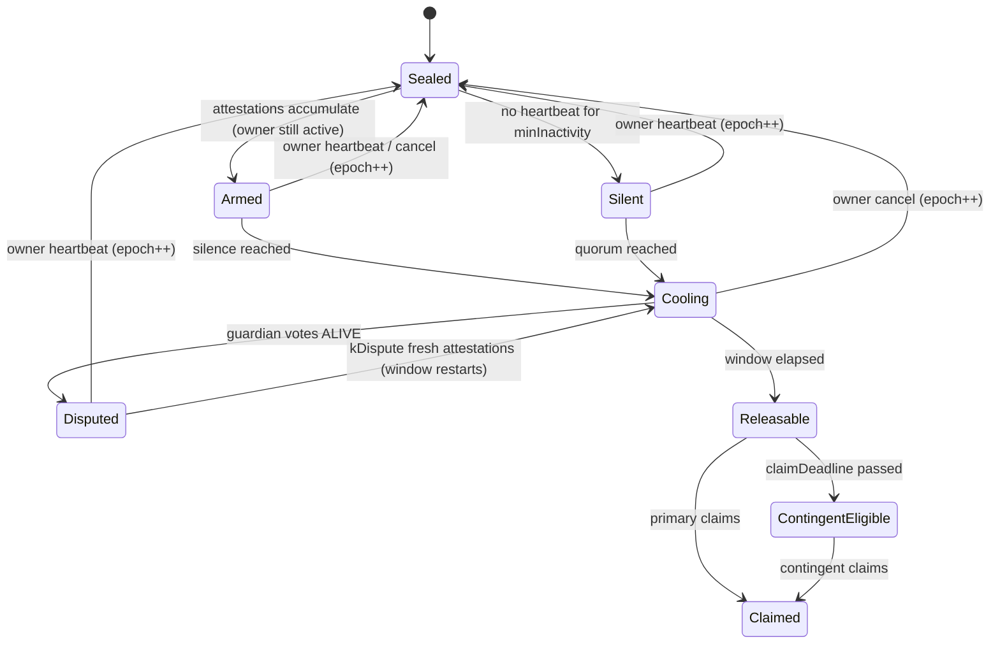

# Purpose: Client user interface specification, asset state machine, emergency intervention mechanisms, audit trail, and engineering build plan.
Depends on: specs/contract.md, specs/crypto.md

## 1. Design invariants

Every component below exists to enforce one of these five invariants. Each item in the demo proves one of them.

| # | Invariant | Enforced by |
|---|---|---|
| **I1** | No single party can decrypt: not Heirloom, not one guardian, not *t* guardians, not the beneficiary. | Split-knowledge key (§4) |
| **I2** | No single signal can start a release. Release needs owner silence **and** a guardian quorum **and** an elapsed window. | Release rule (§5.2) |
| **I3** | While the owner is alive, the owner always wins. One tap cancels everything not yet released. | Epoch reset (§5.5) |
| **I4** | Correctness never depends on our servers or a bot. State is computed lazily from timestamps and signatures. | Keeper-free contract (§6) |
| **I5** | Heirs can recover even if Heirloom shuts down. | Walk-away recovery kit (§7.5) |

---

### 5.4 State machine (per asset, derived, not stored)

### 5.5 Emergency intervention

| Mechanism | Who | Effect |
|---|---|---|
| **Cancel** | Owner (either passkey), one tap from any alert | `epoch++`. All attestations and disputes are void and every asset returns to Sealed. Already released assets show a **"rotate these secrets"** checklist, because a released secret can't be un-released. |
| **Dispute (ALIVE vote)** | Any guardian, once per epoch | Freezes all windows. Cleared by an owner heartbeat, or overridden by `kDispute = kAttest + 1` attestations dated after the dispute, which restarts the window. This bound stops one guardian from causing **permanent loss**. |
| **Planned absence** | Owner | Sets `absentUntil` (a trek, a long hospital stay that was planned). Silence can't start before then. Quorum can still accumulate. |
| **Notification fan-out** | Watchtower + guardian clients | The first attestation, every dispute, and every release alerts the owner on all channels and alerts all guardians. |

### 5.6 Asymmetric policy timelock

Changes that make a policy **stricter** apply instantly: raising a quorum, lengthening a window, adding evidence, cancelling. Changes that make it **looser** go into a queue for `policyDelay` (default 7 days) while all guardians are notified: lowering a threshold, changing a beneficiary, replacing a bundle or guardian set. Someone who briefly gets hold of the owner's device therefore can't silently redirect the inheritance, and the real owner can cancel the queued change.

### 7.1 Heirloom Client (React + Vite PWA)

One app with three role views. **All cryptography runs on the client.** Owner view: create the vault, add assets, set per-asset policies, see the guardian-readiness dashboard and the queued-changes panel. Guardian view: pending alerts, attest, dispute, release, drill. Beneficiary view: claim status and decrypt and download.

---

## 9. Auditability and privacy

- **Audit timeline:** the client rebuilds the full history from events (who attested what and when, who disputed, who released, who claimed), with links to the block explorer.
- **Audit export:** a signed report listing tx hashes, useful to show an executor, lawyer or court that access happened only after the agreed conditions. Heirloom is the **access layer**, not the **legal title layer**. It complements a will and does not replace one.
- **Privacy:**
  - Participants appear on-chain only as key hashes. Names, assets and contacts are never on-chain.
  - Heartbeats are day-granular, so they don't leak your daily routine.
  - **Guardian blindness:** guardians are not shown who the other guardians are. This follows the social-recovery guidance that guardians should not know each other, to reduce collusion. They only need to act independently, never to coordinate.

---

## 14. Build plan

**P0: must work on stage**
1. Contract: vaults, assets, heartbeat/epoch, attest, cancel, release rule, `submitShare`, `markClaimed`, events, `TIME_UNIT`. Foundry tests for every invariant.
2. Client crypto: seal (DEK, XOR split, Shamir, HPKE, commitments) and reconstruct (verify, combine, decrypt).
3. Three role views + audit timeline. EOA signer mode.
4. IPFS upload/fetch.

**P1: what makes it defensible**
5. Passkey signer mode (on-chain WebAuthn verification) + PRF-derived keys + relayer.
6. Dispute + override, planned absence, contingent beneficiary, asymmetric timelock.
7. Watchtower alerts (email + Telegram).
8. Readiness drills + slack dashboard.

**P2: if time remains**
9. Walk-away recovery page pinned to IPFS + printable Recovery Card.
10. Evidence co-attestation UI with digital-signature check of certificate PDFs.
11. Optional Layer 3 (TACo-gated `K_b`).
12. On-chain asset module: ETH/ERC-20 held by the vault transfers directly to the beneficiary when releasable. For on-chain assets this is better than releasing a seed phrase at all.

**Suggested split for 4 people:** (A) contracts + tests, (B) client crypto library, (C) React UI + audit timeline, (D) relayer, watchtower, IPFS, demo scripting.

---
