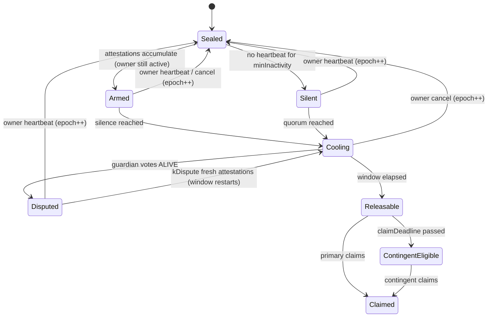

# Purpose: Smart contract specification (`HeirloomRegistry`), release policies, state machine, on-chain failure handling, and threat model.
Depends on: specs/crypto.md

## 1. Design invariants

Every component below exists to enforce one of these five invariants. Each item in the demo proves one of them.

| # | Invariant | Enforced by |
|---|---|---|
| **I1** | No single party can decrypt: not Heirloom, not one guardian, not *t* guardians, not the beneficiary. | Split-knowledge key (§4) |
| **I2** | No single signal can start a release. Release needs owner silence **and** a guardian quorum **and** an elapsed window. | Release rule (§5.2) |
| **I3** | While the owner is alive, the owner always wins. One tap cancels everything not yet released. | Epoch reset (§5.5) |
| **I4** | Correctness never depends on our servers or a bot. State is computed lazily from timestamps and signatures. | Keeper-free contract (§6) |
| **I5** | Heirs can recover even if Heirloom shuts down. | Walk-away recovery kit (§7.5) |

---

## 5. Unavailability detection and the release rule

### 5.1 Signal classes

| Class | Signal | Who produces it | Can it be faked by one person? |
|---|---|---|---|
| **Passive** | Heartbeat lapse: no owner-signed action for `minInactivity` | Owner's devices. Every app open sends a silent passkey-signed heartbeat. | No. Only the owner's passkey can reset it, and nobody can forge the silence away. |
| **Human** | Attestation `{DECEASED, INCAPACITATED, MISSING}` | Each guardian, independently, signed | No, a quorum `kAttest` is needed. |
| **Documentary** (policy-optional) | Evidence hash of a death or medical certificate. The document is encrypted to guardians only. | Guardians attest the **same** hash. ≥ 2 are required. | No, two independent co-attesters are needed. |

**Why the documentary class is optional and never sufficient on its own:** India's Civil Registration System now issues digitally signed certificates, but in 2026 the Registrar General ordered stricter checks after fraud in digitised birth and death records. A document is evidence, not proof, so it can only *add* a condition. It can never *replace* the human quorum.

### 5.2 The release rule (computed lazily, no keeper)

For asset *a* in the current epoch *e* (the epoch increments on **every** owner action):

```
t_silence(a) = max(lastHeartbeat + minInactivity_a, absentUntil)
t_quorum(a)  = timestamp of the kAttest_a-th valid attestation in epoch e
               whose reason ∈ reasons_a
               (and, if requireEvidence_a, ≥2 of them share one evidenceHash)
t_open(a)    = max(t_silence(a), t_quorum(a), resumeAt)     # resumeAt from dispute override

isReleasable(a) ⇔ t_quorum defined
               ∧ now ≥ t_open(a) + window_a
               ∧ ¬disputed(e)
```

Properties that follow directly from this rule:

- **An active owner cannot be griefed.** Attestations filed while heartbeats are fresh never satisfy `t_silence`, and the next heartbeat wipes them.
- **A dead owner cannot be blocked by one person.** One dispute per guardian per epoch, overridable by a larger quorum (§5.5).
- **Sudden death does not wait twice.** Guardians can attest *before* the lapse completes. Attestations "arm" the release and the lapse "fires" it.
- **No cron job.** If every server dies, `isReleasable` still returns the right answer.

### 5.3 Conditional access: example policies (one case, staged release)

| Asset | Reasons | `minInactivity` | `kAttest` (n=5, t=3) | Evidence | `window` | Earliest release after the last heartbeat |
|---|---|---|---|---|---|---|
| Medical records, insurance, doctor contacts | INCAPACITATED, DECEASED | 3 days | 3 | – | 2 days | ~5 days |
| Personal letters, account list | DECEASED, MISSING | 30 days | 2 | – | 7 days | ~37 days |
| Crypto seed phrase, bank credentials | DECEASED only | 45 days | 3 | ✅ 2 co-attest | 30 days | ~75 days |

Window lengths are calibrated against deployed social-recovery systems: Argent uses about 36 hours and Candide's Safe module defaults to 14 days. We go longer for irreversible assets because inheritance is not urgent in the way a lost wallet is.

Each asset also lists a **primary** and a **contingent** beneficiary with a `claimDeadline`. If the primary hasn't claimed by then (they may also have died), guardian clients re-encrypt shares to the contingent beneficiary.

### 5.4 State machine (per asset, derived, not stored)



### 5.5 Emergency intervention

| Mechanism | Who | Effect |
|---|---|---|
| **Cancel** | Owner (either passkey), one tap from any alert | `epoch++`. All attestations and disputes are void and every asset returns to Sealed. Already released assets show a **"rotate these secrets"** checklist, because a released secret can't be un-released. |
| **Dispute (ALIVE vote)** | Any guardian, once per epoch | Freezes all windows. Cleared by an owner heartbeat, or overridden by `kDispute = kAttest + 1` attestations dated after the dispute, which restarts the window. This bound stops one guardian from causing **permanent loss**. |
| **Planned absence** | Owner | Sets `absentUntil` (a trek, a long hospital stay that was planned). Silence can't start before then. Quorum can still accumulate. |
| **Notification fan-out** | Watchtower + guardian clients | The first attestation, every dispute, and every release alerts the owner on all channels and alerts all guardians. |

### 5.6 Asymmetric policy timelock

Changes that make a policy **stricter** apply instantly: raising a quorum, lengthening a window, adding evidence, cancelling. Changes that make it **looser** go into a queue for `policyDelay` (default 7 days) while all guardians are notified: lowering a threshold, changing a beneficiary, replacing a bundle or guardian set. Someone who briefly gets hold of the owner's device therefore can't silently redirect the inheritance, and the real owner can cancel the queued change.

---

## 6. Smart contract: `HeirloomRegistry`

Single contract holding many vaults (no per-user deployment). Solidity + Foundry + OpenZeppelin 5.x. **No owner, no proxy, no pause.** The only privileged party anywhere is each vault's owner.

### 6.1 Storage (simplified)

```solidity
enum Reason { NONE, INCAPACITATED, DECEASED, MISSING }

struct Signer { bytes32 qx; bytes32 qy; }          // P-256 passkey pubkey (EOA mode also supported)

struct AssetPolicy {
    uint8   reasonsMask;
    uint8   kAttest;
    bool    requireEvidence;
    uint32  minInactivity;
    uint32  window;
    uint32  claimDeadline;
    bytes32 primaryBenef;       // keccak(pubkey)
    bytes32 contingentBenef;
    bytes32 bundleCid;
    uint16  version;
    bytes32[] shareCommitments; // index-aligned with guardians
}

struct Attestation { Reason reason; uint40 at; bytes32 evidenceHash; }

struct Vault {
    Signer[2] owner;            // primary + backup passkey
    bytes32[] guardians;        // key hashes only ("guardian blindness")
    uint8   t;
    uint32  epoch;
    uint40  lastHeartbeat;      // day-granular to limit activity leakage
    uint40  absentUntil;
    uint40  disputedAt;  uint40 resumeAt;
    uint32  policyDelay;
    mapping(uint32 => mapping(uint8 => Attestation)) att;   // epoch → guardian → attestation
    mapping(uint8  => uint40) lastDrill;                     // guardian → readiness proof
    mapping(bytes32 => AssetPolicy) assets;
    mapping(bytes32 => PendingChange) queued;
}
```

### 6.2 Functions

| Function | Caller | Notes |
|---|---|---|
| `createVault(owners, guardians, t, policyDelay)` | Owner | Checks `t ≤ n`. Client warns if `n < t + 2`. |
| `addAsset(assetId, policy)` | Owner | Rejects beneficiary ∈ guardians. |
| `heartbeat()` / any owner call | Owner | `lastHeartbeat = today`, `epoch++` |
| `cancel()` | Owner | Explicit heartbeat with a loud event. |
| `setAbsence(until)` | Owner | Planned absence. |
| `queueChange` / `applyChange` / `revokeChange` | Owner | Asymmetric timelock (§5.6). |
| `attest(reason, evidenceHash)` | Guardian | One per guardian per epoch, upgradable (INCAPACITATED → DECEASED). |
| `dispute()` | Guardian | Once per epoch. |
| `submitShare(assetId, encShare)` | Guardian | `require(isReleasable)`. Stores the ~113-byte ciphertext. |
| `markClaimed(assetId)` | Claimant | Ends the asset lifecycle. |
| `drill(version)` | Guardian | Readiness proof (§8). |
| `isReleasable` / `currentClaimant` / `status` | Anyone | Pure views. This is where the lazy evaluation lives. |

### 6.3 Signatures and replay protection

The WebAuthn `challenge` is the **EIP-712 digest** of `{vaultId, action, params, nonce[signer], chainId, contract}`. The relayer only submits `(payload, webauthnAuth)`. Changing anything invalidates the signature, and each nonce works once. For the MVP the same functions also accept EOA signatures (`ecrecover`) through a signer-type flag, so the demo doesn't depend on passkey edge cases.

### 6.4 Events (the audit log)

`VaultCreated · AssetAdded · Heartbeat(epoch) · Cancelled · AbsenceSet · ChangeQueued/Applied/Revoked · Attested(guardian, reason, evidenceHash) · Disputed · DisputeOverridden · ShareSubmitted(asset, guardian) · Claimed(asset, claimant) · DrillPassed(guardian) · Rekeyed(asset, version)`

### 6.5 Demo time unit

The constructor takes `TIME_UNIT` (86400 in production, 60 in demo), so "30 days" plays out in 30 minutes on stage. Foundry tests use `vm.warp` to cover the full lifecycle in milliseconds.

---

## 8. Failure handling matrix (Contract & Relayer)

| Failure | Detection | Response |
|---|---|---|
| Beneficiary dead or absent | `claimDeadline` passes | Contingent beneficiary becomes claimant. |
| One guardian blocks via dispute | Dispute open | Overridable by `kAttest + 1` fresh attestations, so permanent loss is impossible from one actor. |
| Relayer down or censoring | Tx not mined | Direct submission from any wallet. |

---

## 10. Threat model

| Adversary | Goal | Outcome |
|---|---|---|
| Beneficiary alone | Early access | Has only `K_b`. Can't create silence or a quorum. ❌ |
| Up to *t* guardians | Steal secrets | Have only `K_g`. ❌ |
| Guardians file false "DECEASED" while owner is alive | Trigger release | Owner's heartbeats block `t_silence`. The first attestation alerts the owner, and one tap wipes it. ❌ |
| One malicious guardian | Block heirs forever | One dispute per epoch, overridable. ❌ |
| One malicious guardian | Corrupt reconstruction | Commitment mismatch, attributable. ❌ |
| Heirloom insider / breached server | Read secrets or force release | Ciphertext only. Can't sign as anyone. No admin key on the contract. ❌ |
| Attacker with brief access to owner's device | Redirect inheritance | Loosening changes are timelocked 7 days and guardians alerted. ❌ (mitigated) |
| Removed guardian with old shares | Decrypt old version | Still needs the old `K_b`. Old CIDs unpinned. ⚠️ Partial, see §4.6. |
| Beneficiary + *t* guardians colluding **off-protocol** | Early access | ⚠️ **Residual.** Mitigated by the beneficiary ≠ guardian rule, guardian blindness, and diverse guardian selection guidance. Optional Layer 3 (§11) closes it. |
| Thief holding owner's passkey long-term | Act as owner | ⚠️ Equivalent to identity theft in any system. Mitigated by device-bound biometrics and the policy timelock. |

---
